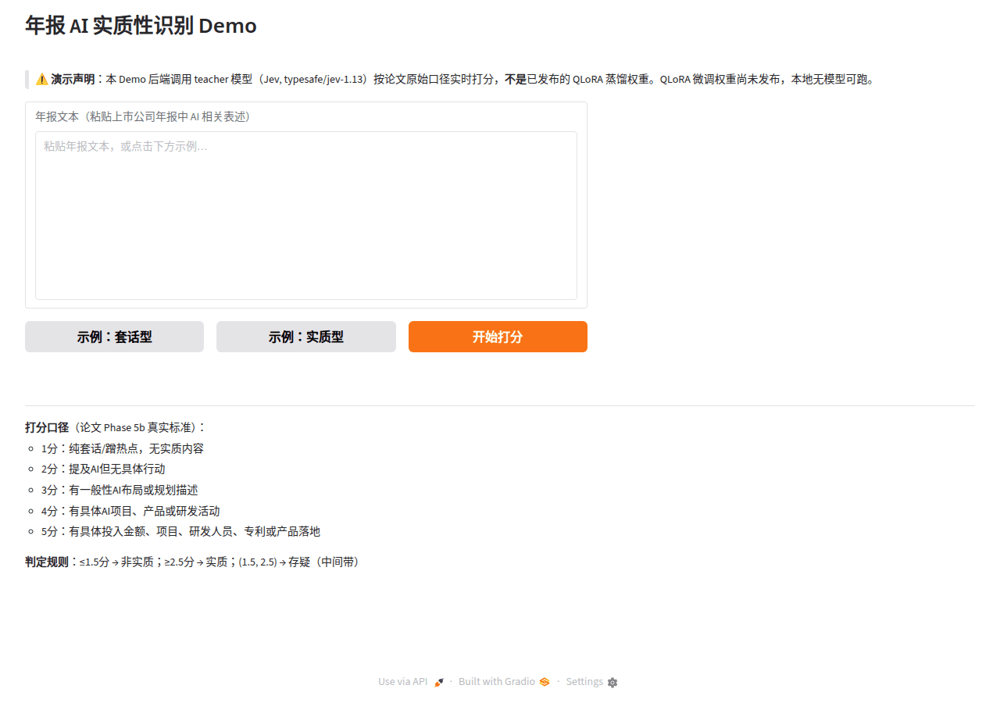

# QLoRA 年报 AI 实质性识别

<p align="center">
  <a href="docs/demo-20s.mp4">
    
  </a>
</p>

<p align="center">🎬 <a href="docs/demo-20s.mp4"><b>观看 20 秒演示视频</b></a> ｜ 金融 AI 落地：年报 AI 实质性识别打分演示（1–5 分实质性口径）</p>

把大模型对 A 股年报的「AI 应用实质性」打分，蒸馏到可在单张消费级 GPU 上运行的小模型：用 QLoRA 微调 Qwen2.5-1.5B / 3B 做二分类（实质 / 非实质），并系统对照数据量、训练轮次、LoRA 秩与模型尺寸四个维度的影响。

## 任务与数据

- **标签来源**：33,948 条公司—年年报文本经大模型按统一口径打分（≤1.5 判非实质、≥2.5 判实质），从中筛选类别平衡语料。
- **数据集**：v1 共 3,000 条（train/val/test = 2400/300/300）；v2 扩至 6,400 条（按同样 8:1:1 划分）。
- **完整性**：训练前用 `scripts/leakage_check.py` 按文本哈希自查——train/val/test 两两零重叠、标签五五开，结果见下文。

## 方法

- 基座：Qwen2.5-1.5B-Instruct / Qwen2.5-3B-Instruct，4bit NF4 量化加载
- LoRA：alpha 32、dropout 0.05（秩 r 取 16 或 32 对照），学习率 2e-4 cosine，有效 batch 16，seed 42
- 硬件：单张 RTX 4090D 24GB（云 GPU 按量租用）

## 结果（test 集 300 条）

| 配置 | 数据 | 轮次 | test F1 | 备注 |
|---|---|---|---|---|
| 1.5B zero-shot | — | — | 0.6154 | 118/300 拒答 |
| 1.5B r16 | 2,400 | 1 | 0.6199 | |
| 1.5B r32 | 2,400 | 1 | 0.5977 | 秩翻倍无增益 |
| 1.5B r16 | 2,400 | 2 | 0.6833 | |
| 1.5B r16 | 6,400 | 1 | 0.6851 | |
| 1.5B r16 | 6,400 | 2 | 0.7613 | |
| 3B zero-shot | — | — | 0.3459 | 极保守：P 0.914 / R 0.213 |
| 3B r16 | 2,400 | 1 | 0.7021 | |
| **3B r16** | **6,400** | **2** | **0.7746** | acc 0.7633，全组最优 |

**结论**：数据量与训练轮次各贡献约 +6~7pt F1 且可叠加；LoRA 秩翻倍（16→32）反而略降；模型从 1.5B 放大到 3B 只多 +1.3pt——**配方效应远大于尺寸效应**。

## 误差分析（`results/`）

- 三个 1.5B 配置共有 39 条「顽固错例」在所有配置下都判错（占错例并集 27.3%）；随着数据与轮次增加，总错例 103 → 89 → 74，见 `results/error_crossconfig_20261004.md`。
- 假阳性偏向技术词密集文本（如「新能源」「电控系统」），假阴性偏向模板化表述（如「有限公司」「非经常性损益」），逐条样本见 `results/errors_*.jsonl`。

## 复现

```bash
pip install -r requirements.txt
# 1) 构建数据（见下方数据说明）
python scripts/build_data.py        # v1 3000 条；build_data_v2.py 为 6400 条
# 2) 泄漏自查（训练前必跑）
python scripts/leakage_check.py ./data ./data_v2
# 3) 训练（QLORA_DATA_DIR / QLORA_OUT_DIR 可覆盖路径）
python scripts/train_qlora.py
# 4) 评测
python scripts/eval_qlora.py --adapter ./qlora-annual-report-adapter --data ./data/test.jsonl
```

## 数据与权重说明

- 训练文本来自上市公司公开披露的年度报告；大模型打分与上下文抽取管线（`f05b_substance` 模块）属于另一研究项目，未随本仓库发布，`build_data*.py` 中的数据路径为占位，请按本地管线调整后使用。训练/评测/泄漏检查三个脚本可独立运行于任意同格式 jsonl 数据。
- LoRA adapter 权重未随仓库发布（体积考虑），按上述脚本可完整复现；全部评测日志与误差文件已收录在 `results/`。

## 边界

本仓库为个人研究项目的实证记录，非生产服务；分类口径继承自大模型打分，结论适用于该口径下的蒸馏任务。

## License

MIT
